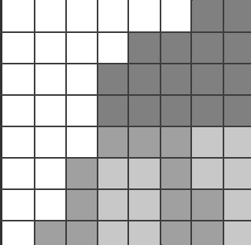

# nesprite
A simple NES sprite tile viewer written in [Go](https://go.dev/).

### Building
`go build nesprite.go`
### Running
`./nesprite <path to .nes file>`

The result will be one or more .png images, depending on the size of the 
CHR ROM in the .nes file.  Each image will be 128x256 and contain 512 
sprite tiles.  Below is a sample image from Super Mario Bros.


#### How the NES builds a sprite
Most, but not all, NES games store their sprite data in CHR ROM. 
The sprites in CHR ROM are stored in 8kb banks. The actual way in which the NES
constructs a sprite from memory is best served with an example, but first some 
details about sprite tiles. Sprite tiles are 8x8 pixels in dimension for a total of 64 pixels.
Each row in a tile is made from 2 bytes for a total of 16 bytes per tile.  For the example,
we will be using the first tile from Super Mario Bros, shown below.



Each pixel (sub-square in the above image) has a 2 bit value formed by combining the bits of bytes located
a byte apart. Here's an example showing how the first row of the above image is formed.
```
    [0x00]  0  0  0  0  0  0  1  1
    [0x08]  0  0  0  0  0  0  0  0
           00 00 00 00 00 00 01 01
```
As you can see, each bit of the bytes at addresses 0x00 and 0x08 are added together to form the value of each pixel in
the row, giving us | 0 | 0 | 0 | 0 | 0 | 0 | 1 | 1 |.  The same process is repeated for every row in every tile, giving each pixel one of 
four possible values.  

Here is the math for the bottom row of this same tile.
```
    [0x07]  0  1  1  0  0  1  1  0
    [0x0f]  0  1  1  1  1  1  1  1
           00 11 11 10 10 11 11 10 
```
This gives us the values | 0 | 3 | 3 | 2 | 2 | 3 | 3 | 2 |.

This data does not contain any color information.  It is an indexed format where 
each pixel value acts as an index into a palette, which is chosen at runtime.
This means each tile can only contain 4 colors represented by 00 (0), 01 (1), 10 (2), and 11 (3). 
Currently, nesprite outputs greyscale only.
